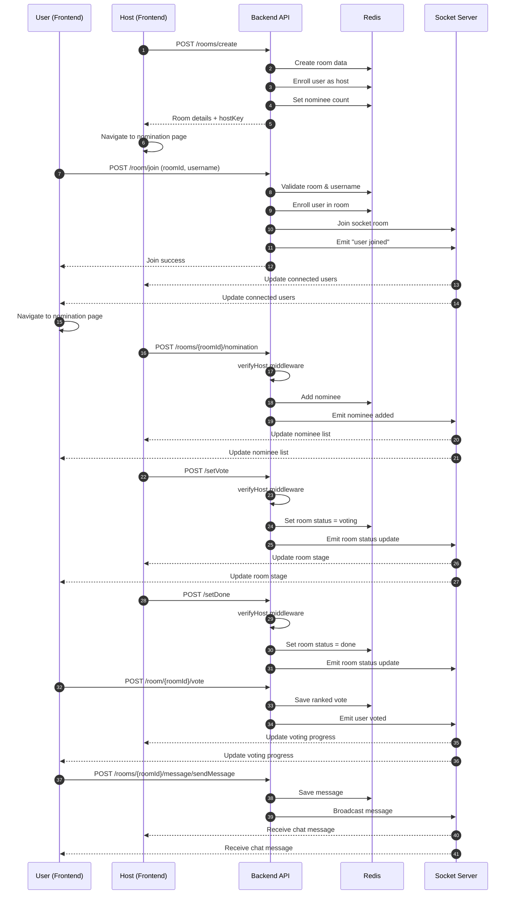
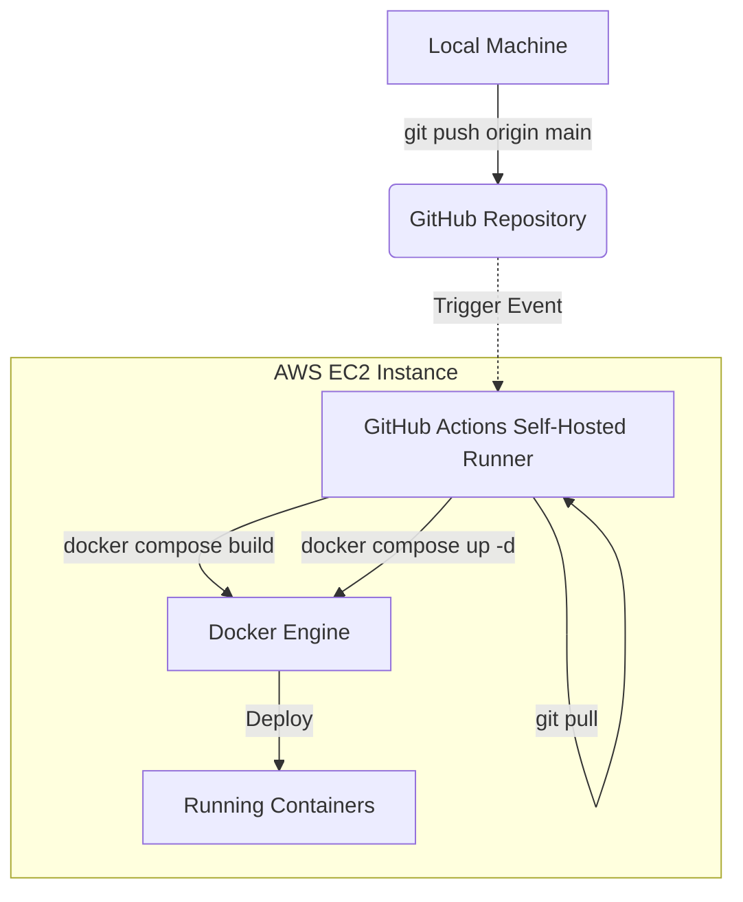

# Tideman Vote — Real-Time Ranked-Choice Voting

🔗 **Live Demo:** [https://www.tidemanvote.uk/](https://www.tidemanvote.uk/)

Tideman Vote is a real-time group voting application implementing **Ranked Pairs (Tideman / Condorcet) voting**.  
Unlike winner-takes-all voting, it minimizes dissatisfaction by selecting the option that would win in all head-to-head matchups when possible.

This project focuses on **correct voting algorithms, real-time distributed state, and production-style system design**.
📖 More: [https://en.wikipedia.org/wiki/Ranked_pairs](https://en.wikipedia.org/wiki/Ranked_pairs)

## Screenshots

  
  

# Tech Stack 
### Backend
    

- **Express + TypeScript**
- **Redis** (low-latency, TTL-based ephemeral storage)
- **Socket.IO** (real-time updates)
- **Bun** runtime (including test runner)
- **Docker + Docker Compose**
- **AWS EC2**

### Frontend 
   

- **Next.js + React**
- **Zustand** (global room state)
- **TanStack Query** (data fetching & mutations)
- **Deployed on Vercel**

# Room Lifecycle 

**Key Stages**
- Room creation & host authorization
- Nomination & stage transitions
- Voting & real-time progress updates
- Result finalization & chat
  

  
**Room Creation**
- on the user side (from the homepage), a user creates a room 
- this hits the `/rooms/create` backend endpoint (in `hostRoutes.ts`) where we 
	- create the room and store it in redis 
	- enroll the user into the room as a host 
	- set the nominee count 
	- return the room details (id, nominee count, etc)
- the frontend then moves on to the nomination page
---

**User Join**
- on the user side, a user joins a room with the given room id
- this hits the `/room/join` backend endpoint (in `participantROutes.ts`) whre we 
	- do error checking (room existing, username taken, etc)
	- enroll the user to the room and the socket
	- emit that a new user has entered on the socket 
- where the frontend will move to the nomination page, and the socket emition will result in all connected clients updating the 'connected users' component without a refresh 
---

**Adding Nominees / Progressing The Room Stage**
- only the host can progress the room to another stage and add nominees
- to add nominees, the frontend hits the `/rooms/[roomId]/nomination` (in `hostRoutes.ts`)
	- with the payload including the nominee name
	- the endpoint adds the nomination to redis, and emits the nomination to the socket 
	- the frontend will use the emission and update the nominee component 
- to progress the room, the frontend (from the host side) hits the `/setVote` and `setDone` endpoints to set the room to 'voting' and 'done (count ballots)' respectively
---

**Verifying Host (middleware)**
- for the actions that only the host can access, we use token-based authentication
- on room creation, the user that created the room (host) will receive a 16 byte hostkey
- this hostkey is also saved as roomdata in redis
- any further host route request will go through the middleware defined in `verifyHost.ts`
- users that are not hosts do not have access to the hostkey and have their role defined as 'user'
---

**Submitting Votes**
- once the host has set the room status to 'voting', users can rank their choices on the frontend and submit their vote 
- this hits the `/room/[roomId]/vote` endpoint with the payload with the ranked choices 
- this vote is saved in redis, and the socket emits that this user has voted, updating the frontend as well 
---
**Chat Functionality**
- users are enrolled into the chat room 
- on submission the frontend will hit the `/rooms:[roomId]/message/sendMessage` endpoint 
	- the message will be saved to redis, and 
	- the message will be broadcast on the socket

---

# Deployment & CI/CD
### Frontend
- Deployed on **Vercel**
- Custom domain via Cloudflare DNS

### Backend 
- **AWS EC2 (Free Tier)**
- Dockerized services
- Redis orchestrated via Docker Compose
- **Self-hosted GitHub Actions runner** on EC2:
    - `git push main` → build → deploy automatically
- Port exposed through Cloudflare tunnel 

## What This Project Demonstrates

- Correct implementation of a **non-trivial voting algorithm**
- Real-time system design with WebSockets
- Distributed state synchronization
- Token-based authorization
- Production deployment without managed PaaS abstractions
- Thoughtful tradeoffs in database and framework selection

# Engineering Reflections (Optional Reading)

This section documents design tradeoffs, mistakes, and lessons learned while building Tideman Vote as a solo developer. It is included for readers interested in engineering decision-making and growth over time.

## Test Driven Development

I set my sights on thorough testing, but 

1. At first, i was too eager, going all-out on white-box testing, way too early 
	- This led to tests that were so tightly coupled with initial / incomplete implementations of functions. 
	- mocking data also become incredibly difficult when testing every single function call a class/function does
2. Trying to test without understanding
	-  honestly, I started trying to test without really understanding *what* I should be testing and *why*
	- as a result, i ended up testing things that are completely unnecessary (similar to mistake 2)

In projects after this one, I took a more conservative approach with TDD. Instead of white-box testing every single code path, I broke it down to:
- Error paths that MUST not pass 
- happy paths that MUST pass
This helps establish a 'sanity' check for unit tests, and ensures that crucial integration testing paths are valid. 

Of course, more comprehensive testing would be better, but doing this minimum viable testing helps move my project along. After all, I'm doing these projects by myself without a dedicated QA / testing team. 

## Database Choice 

I could've used a simple SQL database, but the data I'm storing was temporal. And thus, I was led to redis because 
1. I'm not storing much data, so I wouldn't need the engine like postgres / mysql
2. it's easy to store temporal data and give it a TTL, and expire it 
3. the data I'm storing fits more into a document form (nosql)

However, on reflection, I do feel like mongodb may be a better choice. I became more aware of Redis’s memory constraints on a free-tier EC2 instance, especially after introducing chat with unbounded message volume.

Also, using redis meant that I didn't really have a structured schema. I had to set the schema rules with pure strings (which I guess is how it's used in other uses), but it would've been better if I had language hints / support from the LSP. 

Thus, in a future refactor, I think it makes sense to utilize something like mongodb instead. I don't need the ACID / Atomicity that postgres or mysql offers, and mongodb fits the document-based data I'm storing. Furthermore, it's much easier to 'delete' data in chunks of documents in mongodb. 

## WebSockets

When I first started I didn't really understand websockets much. I had only worked with rest APIs, and thus the event model was an enigma to me. The biggest challenge was orchestrating the events with the backend/frontend. 

The backend was simple enough where the routes would hit the socket service (`socketService.ts`) and emit events accordingly. 

The complexity lied mostly on the frontend, where I had to utilize zustand and tanstack query so that I could catch all of the emitted events and update the components on the frontend directly. This taught me to design socket events as first-class API contracts rather than incidental side effects.

## Frontend Framework Choice

React is often taught or referred to as a frontend 'framework'. Of course, developers know it is more of library than anything, but to beginners 'framework' is the word of choice that everyone uses. After this project, I really felt the limitations of react, and question if I'd like to continue using it as my frontend framework of choice

First, it promises to be lightweight, but realistically if you want to do anything you need a library to 
1. handle routing / multi-page react 
2. handle global state (prop-drilling galore)
3. handle mutations and fetching 

At this point, coordinating state, routing, and data fetching across multiple libraries significantly increased cognitive overhead.

In the future, I think it would be worthwhile to invest in learning Angular for its robust and standardized solutions. Or maybe even something like Svelte because at least then I don't have to deal with react boilerplate. Incidents like react-shell-cve also made me more cautious about the hidden costs of ecosystem complexity.

### Dependency Injection and Express

Through this project, I learned why dependency injection is a critical design pattern to implement. As the backend grew, I started adding more services and routes. And these services and routes would depend on each other. 

Dependency injection saved me as I could refactor or change implementations without breaking everything. However, I learned more about SOLID *after* finishing this project, and in the codebase I often violated the interface segregation principle by injecting concrete service implementations instead of abstract interfaces. In a refactor, I would definitely avoid directly injecting the actual service class itself instead of an abstract interface. 

Also, managing the dependencies became complex over time. This made me understand why developers love Java and Spring Boot. Having to create the instances and inject them everywhere that's needed in `index.ts` wasn't too bad, but definitely added unneeded manual complexity. 

In my next web-based project, I'll likely avoid using pure express. If I am to use javascript, I'll likely look to use NestJs or Java/Kotlin with Spring Boot. Or if I really need to stay bare-bones I'll use a dependency inversion library. Although, I think I do see batteries-included frameworks more favorably now (see above)
